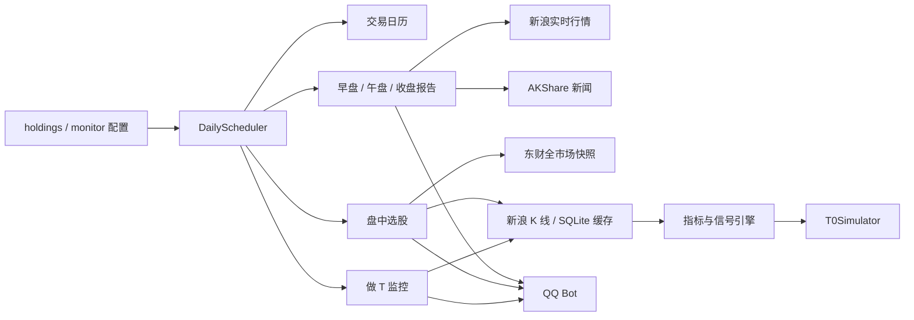

# A-Trade 项目全面审查报告

- **审查日期：** 2026-07-19
- **审查范围：** 架构、行情数据、缓存、指标、信号、回测、监控、调度、通知、测试、依赖、部署、安全与文档
- **总体结论：** 项目已经具备可运行的 MVP 结构，但目前不应把选股结果和回测指标用于真实投资决策。应先修复 P0 数据契约、回测账本、部署依赖与隐私安全问题。

## 1. 当前项目概览

项目约 5,800 行 Python/Shell 代码，主要数据流如下：

已有优点：

- 模块边界初步清晰，数据、指标、信号、回测、监控、报告和通知已经拆分。
- 外部 HTTP 请求普遍配置了超时和有限重试，避免无限阻塞。
- SQLite 使用参数化查询并设置联合主键，基础缓存接口简单可测。
- 交易日与盘中时段有独立封装，调度时区明确为 `Asia/Shanghai`。
- 已有 49 个自动化测试，覆盖缓存、部分行情解析、信号因子和若干回测工具函数。
- `.env` 未进入当前 Git 对象历史，日志、数据库和报告主体已配置忽略规则。

## 2. P0：必须优先处理

### P0-1 回测账本和成交模型不成立

**位置：** `atrade/backtest/t0_simulator.py:228`、`atrade/backtest/t0_simulator.py:253`、`atrade/backtest/t0_simulator.py:307`、`atrade/backtest/t0_simulator.py:324`、`atrade/backtest/t0_simulator.py:370`、`atrade/backtest/t0_simulator.py:378`

当前回测存在相互叠加的系统性偏差：

- 使用当前 K 线的收盘价、最高价、最低价和成交量生成信号，又按同一根 K 线收盘价成交，形成前视偏差。
- 买入 T 仓时没有扣减现金，净值却直接增加持仓市值，最大回撤和收益率会被高估。
- 盈利被加到持仓成本：`(原成本 + 毛利润) / 数量`，方向与“盈利降低成本”相反。
- 反向做 T 卖出底仓后，后续买入同时增加 `base` 和 `t_holdings`，会重复计算股份。
- 反向做 T 没有独立记录待回补数量、卖出收入和回补成本，无法得到真实 T 收益。
- 强制止损没有检查 T+1 锁定状态，可以卖出当天买入且尚未可卖的股份。
- 买入后若没有卖出，最终汇总没有按现金和未平仓头寸统一盯市。
- 日线模式无法还原日内买卖先后顺序，不适合验证“做 T”策略。

**影响：** `final_cost`、`net_t_profit`、最大回撤、胜率、年化收益和对比死拿等核心指标均不可信。

**建议：** 暂停使用现有回测结果；重写为事件驱动账本，至少显式维护 `cash`、可卖底仓、当日买入锁仓、待回补仓位、费用和逐笔成交。信号在第 N 根 K 线确认后，只允许从第 N+1 根 K 线开盘或可配置成交价执行，并为股份守恒、现金守恒、可卖数量和期末盯市添加不变量测试。

### P0-2 盘中选股的东财字段映射和价格单位错误

**位置：** `scripts/screen.py:53`、`scripts/screen.py:68`、`scripts/screen.py:86`、`scripts/screen.py:91`、`scripts/screen.py:93`、`scripts/screen.py:95`、`scripts/screen.py:246`

2026-07-19 对东财接口的实时只读核对显示，在 `fltt=2` 下：

- `f2` 已是实际价格，不需要再除以 100。
- `f7` 是振幅，当前代码误用 `f9`。
- `f9` 是动态市盈率，当前代码把它当振幅。
- `f23` 是市净率，当前代码把它当动态市盈率。
- `f16` 是最低价，但请求字段列表没有包含 `f16`。

现有测试数据人为使用“价格乘 100”的旧假设，因此没有发现真实接口契约变化。

**影响：** 价格显示缩小 100 倍、MA5 过滤几乎必然失败、估值和振幅含义错位，盘中选股可能持续为空或输出错误标的。

**建议：** 建立明确的快照 DTO/Schema，修正字段为 `f2/f3/f4/f5/f6/f7/f8/f9/f10/f12/f14/f15/f16/f20/f23`，统一使用真实价格单位，并添加基于录制接口响应的契约测试。

### P0-3 全新部署缺少生产依赖

**位置：** `requirements.txt:1`、`atrade/monitor/trading_calendar.py:9`、`atrade/news/collector.py:10`、`scripts/deploy_vps.sh:54`

生产代码在模块导入时直接依赖 `akshare`，但 `requirements.txt` 和部署脚本的备用依赖列表都没有安装它。当前机器因为全局环境已安装而能运行，新的虚拟环境或 VPS 按文档部署会在调度器导入阶段失败。

**建议：** 在隔离虚拟环境中重新生成运行依赖与开发依赖，固定兼容版本并增加“全新环境安装 + 核心模块导入”CI。不要依赖系统 Python 的用户级 site-packages。

### P0-4 公开仓库暴露真实持仓和部署目标

**位置：** `config/holdings.json:4`、`config/monitor.json:18`、`docs/deploy_vps_git_push.md:34`、`scripts/install_pre_push_env_sync.sh:5`

GitHub API 确认远端仓库当前为公开仓库。仓库中包含真实成本价、数量、买入日期、持仓备注、VPS 公网 IP 和 `root` 部署方式；Git 历史还存在一次“脱敏 AppID/group_openid”的提交，说明旧值仍可从历史恢复。

**建议：** 立即把真实持仓移到 Git 忽略的本地配置，只提交 `*.example.json`；评估清理公开历史；确认历史中未出现 AppSecret，如无法确认则轮换；关闭公网 root 密码登录，改用受限部署用户、SSH Key、来源 IP 限制和最小化 sudo 权限。公网 IP 本身不是凭据，但不应与 root 自动部署流程一起公开。

## 3. P1：近期修复

### P1-1 日线缓存达到数量阈值后永久不刷新

**位置：** `atrade/data/history.py:131`

当缓存行数达到 `max(60, datalen // 2)` 后，代码永远只读缓存，不根据 `last_date` 增量拉取。当前数据库最后日期为 2026-07-17；下一个交易日后仍可能继续返回旧数据。

**建议：** 按交易日和数据源时间戳判断新鲜度；从最后日期向前重叠 3-5 个交易日增量拉取并 upsert；离线回测显式禁用实时快照。

### P1-2 历史成交额被放大 100 倍

**位置：** `atrade/data/history.py:179`

实时核对 `600519` 的新浪 K 线和实时报价后，K 线 `volume=5,841,730` 与报价成交量一致，`close * volume ≈ 73.20 亿元` 与实时报价成交额 `73.23 亿元` 一致。当前再乘 100 会得到约 `7,319.69 亿元`。

**建议：** 将成交额改为 `close * volume`，并用同日实时成交额做容差契约测试；同时明确所有数据源的“股/手”和“元/万元”单位。

### P1-3 财报 TTM EPS 对中报和三季报计算错误

**位置：** `atrade/data/eastmoney.py:236`

当前跨年计算固定寻找上一年一季报。若最新报表是中报或三季报，应减去上一年同周期累计 EPS，而不是一季报 EPS。

**建议：** 按最新 `REPORT_TYPE` 匹配上一年同类型报表；增加 Q1、半年报、Q3、年报、缺失同期和负 EPS 测试。

### P1-4 做 T 告警去重和送达语义不可靠

**位置：** `atrade/monitor/t_monitor.py:103`、`atrade/monitor/t_monitor.py:122`、`atrade/scheduler/runner.py:269`

状态文件每只股票只保存最后一个信号 key。同一次扫描有多个信号时，下一次扫描会重新发送前面的信号；同时状态在实际推送前就持久化，推送失败后该告警可能永久丢失。

**建议：** 使用带日期/TTL 的已发送 key 集合；先构造告警，再由通知层成功确认后提交状态；为重复扫描、发送失败重试和进程重启添加测试。

### P1-5 回测 `--push` 必然调用不存在的方法

**位置：** `scripts/run_backtest.py:115`、`atrade/notify/botpy_notifier.py:132`

CLI 调用 `BotpyNotifier.send_markdown()`，实际类只提供 `send_group_markdown(group_openid, markdown_content)`，且 CLI 没有传群 ID。

**建议：** 统一唯一通知接口，消除 `OpenClawNotifier`、`BotpyNotifier` 和调度器内置推送的重复实现，并为文本、Markdown、降级、超时和鉴权失败添加适配器测试。

### P1-6 Markdown 截断按字符而非字节

**位置：** `atrade/scheduler/runner.py:186`

注释写的是 4096 字节限制，但实现截取 3800 个字符。中文 UTF-8 通常占 3 字节，仍会远超平台字节上限。

**建议：** 按 UTF-8 字节安全截断，优先按段落拆分多条消息，并记录平台错误码和重试结果。

### P1-7 部署不可复现、无原子切换和回滚

**位置：** `scripts/vps_install_deploy_target.sh:55`、`scripts/vps_install_deploy_target.sh:59`、`scripts/vps_install_deploy_target.sh:67`、`scripts/vps_install_deploy_target.sh:80`

每次 push 直接覆盖工作目录、在线升级未锁定依赖并重启服务；服务默认以 root 运行，没有安装前测试、健康检查、失败回滚或旧版本保留。

**建议：** 使用受限用户和 release 目录，先在新目录安装锁定依赖、运行测试/导入检查，再原子切换 `current` 软链接；健康检查失败自动回滚。不要在 post-receive 中升级 pip。

### P1-8 策略验证不足，容易得到过拟合结论

**位置：** `atrade/signals/engine.py:69`、`tests/test_t0_simulator.py:161`、`tests/test_t0_simulator.py:180`

当前测试主要验证手工构造的局部因子。T+1 测试只检查 dataclass，cooldown 测试只检查属性存在，没有验证交易行为；没有 walk-forward、样本外、基准策略、涨跌停、停牌、最小佣金、整手约束和不同市场阶段验证。

**建议：** 核心账本正确后，再建立训练期/验证期/样本外区间和无信号基线；报告交易次数、收益分布、最大回撤、暴露资金、换手率和参数敏感性。

## 4. P2：工程质量改进

### P2-1 生产包反向依赖 CLI 脚本

**位置：** `atrade/monitor/screen_monitor.py:10`

生产模块从 `scripts.screen` 导入业务函数，导致打包、复用和测试边界混乱。

**建议：** 将市场快照和筛选逻辑移入 `atrade/screen/`，CLI 只负责参数解析和调用。

### P2-2 缺少项目元数据、锁文件和 CI

仓库没有 `README.md`、`pyproject.toml`、CI、格式化、静态检查、类型检查或安全依赖扫描配置，依赖也完全未固定版本。

**建议：** 添加 `pyproject.toml`，定义 Python 版本、运行/开发依赖、pytest 路径、Ruff 和类型检查；在 GitHub Actions 中执行隔离安装、测试、编译、Shell 检查和依赖审计。

### P2-3 配置重复且缺少 Schema 校验

**位置：** `config/holdings.json:1`、`config/monitor.json:13`、`atrade/scheduler/runner.py:34`

持仓在两个 JSON 中重复；`watch_keywords` 存在于 holdings 配置，但调度器使用硬编码关键词；`news.enabled` 没有控制新闻任务。错误字段通常被静默回退为空配置。

**建议：** 建立单一配置源和显式 Schema，启动时一次性校验代码格式、正数成本、整手数量、区间参数和必需环境变量，配置错误应阻止启动。

### P2-4 外部接口异常大量被降级为空结果

项目中有 38 处 `except Exception`。这提高了短期可用性，但也会把字段变化、代码错误和网络错误都表现成“暂无数据”。

**建议：** 区分超时、HTTP、解析、Schema 和业务空数据；为每个数据源记录成功率、耗时、最后成功时间和降级来源，并在连续失败时告警。

### P2-5 调度器启动状态和异步生命周期不严谨

**位置：** `atrade/scheduler/runner.py:305`、`atrade/scheduler/runner.py:311`、`atrade/scheduler/runner.py:329`

等待 30 秒后无论机器人是否 READY 都记录成功并启动任务；提交到事件循环的 Future 没有统一追踪；停止时没有等待 bot 线程退出。

**建议：** 使用显式 READY/STOP 事件，未 READY 时启动失败；集中处理 Future 结果、超时和异常；停止时关闭调度器、客户端、事件循环并 join 线程。

### P2-6 日志可能无限增长

launchd 和 systemd 都把日志持续追加到固定文件，应用没有轮转、保留期或磁盘告警。

**建议：** systemd 优先写 journald 并设置保留策略；本地使用 Loguru rotation/retention；日志禁止输出 token、完整 openid 和完整外部响应。

## 5. P3：文档与一致性

- `scripts/screen.py:7` 文档使用不存在的 `--symbols`，实际参数是 `--code-in`。
- `scripts/screen.py:315` 和 `scripts/screen.py:317` 的帮助文本包含未转义 `%`，导致 `python3 scripts/screen.py --help` 抛出 `ValueError`。
- `atrade/signals/__init__.py:3` 的信号清单与当前四个 BUY 因子、两个 SELL 因子不一致。
- `scripts/run_scheduler.py:6` 仍描述 4 个任务，而调度器实际注册 6 个任务。
- `launchd/com.a-trade.scheduler.plist:10` 固定使用 `/usr/bin/python3`，并硬编码本机绝对路径，不适合其他机器或独立虚拟环境。
- 测试文件和手动联网脚本都以 `test_*.py` 命名，pytest 会扫描并产生 collection warning；建议移到 `scripts/manual/` 并改为 `check_*.py`。

## 6. 验证结果

| 检查 | 结果 | 说明 |
| --- | --- | --- |
| `python3 -m pytest -q` | 通过 | 49 passed，2 个手动脚本 collection warning |
| `python3 -m compileall -q atrade scripts tests` | 通过 | Python 文件可编译 |
| `bash -n start.sh scripts/*.sh` | 通过 | Shell 语法通过 |
| `plutil -lint launchd/com.a-trade.scheduler.plist` | 通过 | plist 语法通过 |
| `python3 scripts/run_backtest.py --help` | 通过 | CLI 可展示帮助 |
| `python3 scripts/screen.py --help` | 失败 | `%` 未转义导致 argparse 格式化异常 |
| 核心模块导入 | 当前机器通过 | 依赖全局环境，不能证明全新环境可部署 |
| `python3 -m pip check` | 失败 | 当前全局 Python 还有 OpenTelemetry/grpc 依赖问题，应改用项目独立 venv |
| Ruff/Mypy/Pyright/Coverage/Bandit/pip-audit | 未配置 | 当前环境未安装，仓库也没有对应配置 |

测试“全绿”与 P0 问题并不矛盾：现有测试没有对实时字段契约、现金账本、股份守恒、反向做 T、下一根 K 线成交、告警送达和全新部署做断言。

## 7. 推荐实施路线图

### 阶段 A：立即止血（1-2 天）

1. 暂停使用当前回测和盘中选股结果做真实交易决策。
2. 将真实持仓和部署目标移出公开仓库，处理历史隐私暴露并收紧 VPS SSH。
3. 修复 `akshare` 依赖，建立隔离虚拟环境和最小启动检查。
4. 修复东财字段映射、价格单位和历史成交额，补接口契约测试。
5. 修复选股 CLI 帮助和回测推送接口，避免明显不可用入口。

### 阶段 B：重建正确性（3-7 天）

1. 先写现金守恒、股份守恒、T+1 可卖数量、反向做 T 和期末盯市的失败测试。
2. 重写回测账本和下一根 K 线成交模型，日线与分钟线分开定义能力边界。
3. 实现缓存增量刷新、数据新鲜度、复权处理和数据源/抓取时间元数据。
4. 修正 TTM EPS，并为所有财报周期建立固定样例。
5. 重做告警去重、成功后提交状态和失败重试。

### 阶段 C：工程化（1-2 周）

1. 添加 `pyproject.toml`、锁定依赖、Ruff、类型检查、coverage 和 GitHub Actions。
2. 合并三套 QQ 推送实现，建立统一通知端口与可替换适配器。
3. 将 `scripts.screen` 业务逻辑移入包内，拆分 248 行的回测主函数。
4. 增加配置 Schema、健康检查、结构化日志、指标和告警。
5. 建立原子部署、非 root 服务、健康检查和自动回滚。

### 阶段 D：策略可信度（持续）

1. 使用复权且可追溯的数据集，固定数据版本和回测参数。
2. 做 walk-forward、样本外和无信号对照，避免只看单一持仓和单一行情阶段。
3. 加入涨跌停、停牌、一字板、整手、最低佣金、印花税变化和容量约束。
4. 报告置信区间、参数敏感性、资金占用、换手率和回撤恢复时间。
5. 先纸面交易并对比真实推送与回测成交，再考虑任何自动执行能力。

## 8. 建议拆分的后续任务

建议按以下依赖顺序分别创建独立 TODO/STATUS 目录执行：

1. `security-config-hardening`：公开配置脱敏、部署用户和 SSH 收紧。
2. `market-data-contract-fix`：选股字段、单位、成交额、缓存新鲜度。
3. `backtest-ledger-rewrite`：账本、不变量、下一根 K 线执行和真实费用。
4. `notification-reliability`：统一通知接口、去重、重试和送达状态。
5. `project-tooling-ci`：pyproject、依赖锁、静态检查、coverage 和 CI。
6. `walk-forward-validation`：样本外验证、基线和策略评估报告。

